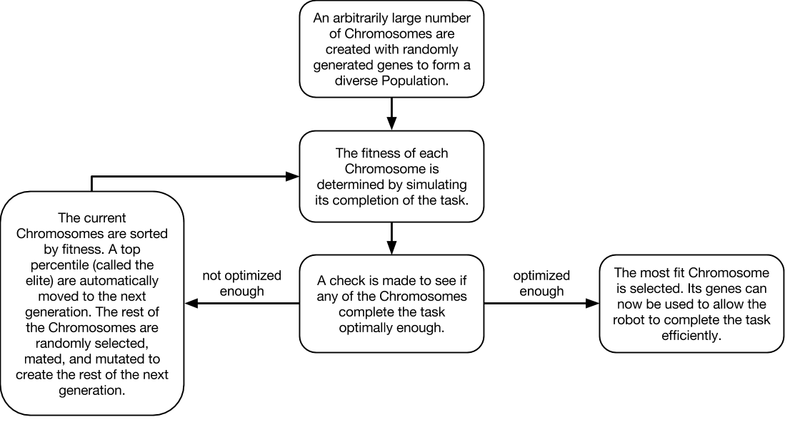
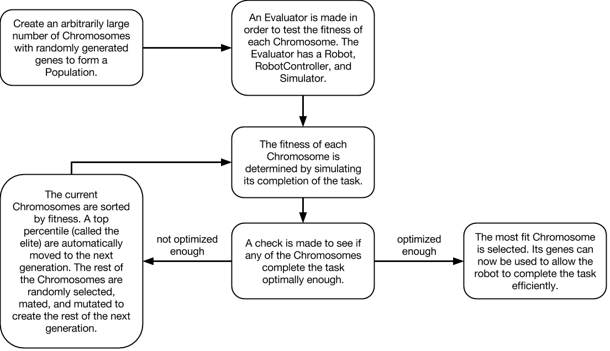
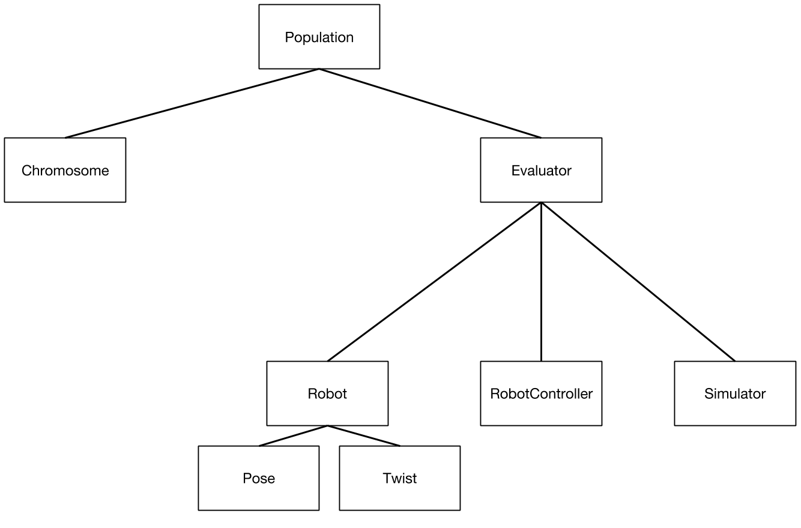
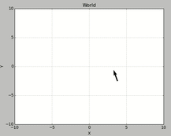
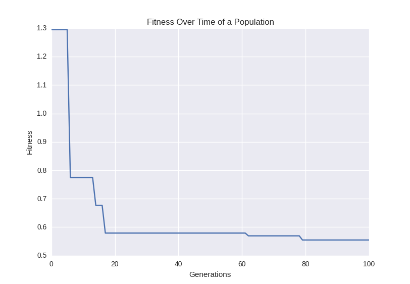

# Genetic Algorithms
### Shane Kelly, Kevin Zhang, David Zhu


# Overview

For our final project in Computational Robotics (Spring 2017), we decided to explore the field of genetic algorithms and multi-robot interactions. During the past few weeks, we’ve added several components to our project. For today’s post, we’ll be sharing our first implementation of a genetic algorithm.

Some backstory: the ultimate goal that we chose to implement is to have two robot Neatos collaborate to move a box into a certain destination. Ideally, we would like the box to be placed and oriented at the goal, and we hope that genetic algorithms can train our robots to work together in making this happen.


# Project Story 1 - Playing with Genetic Algorithms

### 4/20/2017

To break this problem down, we needed to implement our own genetic algorithm so that we can train our robots in simulation. After doing some research, we were able to find a [Hello world for writing genetic algorithms](https://github.com/jsvazic/GAHelloWorld/tree/master/python).

We learned that genetic algorithm consists of several parts:
- **Population.** A collection of chromosomes. This contains all the permutations that we want to consider for our algorithm. Each permutation is encoded as a gene in a chromosome.
- **Chromosome/gene.** These are strings that consists of encoded instructions. Genes directly affect the performance of the organism during its task.
- **Fitness.** Fitness provides us with information on how well a gene performs in the environment. More specifically, fitness defines what it means for our robot to be successful at our task of choice. In the algorithm, the fitness function calculates this value and helps us evaluate which genes propagate in the next generation.
- **Crossover.** Crossover is one channel for chromosomes to produce stronger progeny. Two chromosomes undergo crossover in our evolution function, which allows for the creation of a new gene that may potentially carry the success of its parents.
- **Mutation.** The final step to produce the next generation is to randomly proceed through the Chromosomes and make random changes to their genes. This adds genetic diversity to the Population, which allows the GA to better discover genes with high fitness.

The following is the main run function inside of our RobotController class that uses the genetics of a Robot to send velocity commands.

```
def run(self, duration):
    """
    Main run function.
    duration : float - In seconds
    """
    end_time = time.time() + duration

    try:
        while time.time() < end_time:
            curr_x, curr_y = self.robot.get_position()
            goal_x = 0.0
            goal_y = 0.0

            # Calculate difference between robot position and goal position
            diff_x = goal_x - curr_x
            diff_y = goal_y - curr_y

            try:
                # Calculate angle to goal and distance to goal
                diff_w = math.atan2(diff_y, diff_x)
                diff_r = math.sqrt(diff_x**2 + diff_y**2)
            except OverflowError:
                print diff_x, diff_y

            # Define linear and angular velocities based on genes
            a1, b1, c1, a2, b2, c2 = self.genes
            forward_rate = a1*diff_w + b1*diff_r + c1*diff_r**2
            turn_rate = a2*diff_w + b2*diff_r + c2*diff_r**2

            # Set linear and angular velocities
            self.robot.set_twist(forward_rate, turn_rate)
    except KeyboardInterrupt:
        pass
```

Genetic algorithms are great at tackling problems with well-defined metrics of success, but have little notion of how to actually solve the problem. In this regime, a genetic algorithm will continue to mate, mutate, and interchange variables within the problem until an optimal solution is found. All the while, the genetic algorithm does not need to know exactly what the problem is that it is solving or what the variables meant that it is evolving, as long as it continues to increase the fitness of its population of organisms.

One area that genetic algorithms struggle in is landing in local optima. We noticed this in the Hello World example, where it became really difficult for the algorithm to correctly generate the last letter for the `hello world` string. Since genes are meant to encode instructions for our robot, it is also difficult to use genetic algorithms to program complex tasks for our robot to do. For example, if we wanted our robot to push a box and it misses, it would be very challenging for the robot to recognize this and come back to the box through a simple genetic string. It is hard to conceptually create complex models that can be tuned through genetic parameters to create this behavior.

The example trained a series of genes to generate the string Hello World from a set of random strings. It evaluated the fitness of each Chromosome by finding the ASCII distance of all of its gene’s characters from the string “hello world”. The example then mated the Chromosomes by swapping characters in their genes and mutated them by randomly changing a subset of characters in the Chromosomes’ genes.

We used this example to generalize the steps of a genetic algorithm. Here is a diagram that depicts one high-level implementation of a genetic algorithm.



To transfer this to our own needs, we changed the way that the fitness of an organism was defined. In the GA Hello World example, the genes themselves are directly evaluated for fitness, but in our project the robot's location will need to be translated into a metric of fitness. This extra step requires that we develop an environment to simulate a robot’s actions given a set of genes. Here is a diagram that illustrates the process we envision for training our genetic algorithm (the same as the previous diagram, but with an additional step for fitness evaluation).



Currently, our architecture consists of a Population of many Chromosomes, a Supervisor that allows for fitness evaluation through a simulated Robot, a RobotController that controls the Robot, and a Simulator where the Robot interacts with the world around it. The following is a basic diagram to illustrate this relationship.



Some challenges we’ve faced while implementing this include defining reasonable models for our task and connecting the algorithm to a simulated environment. Since a robot needs to translate a gene into a movement behavior, we have to choose reasonable genetic models to allow the robot to move correctly. Logistic-wise, a genetic algorithm requires lots of training runs, and this requires us to connect our algorithm to a decent simulation environment.

In the present time, we have just finished integrating together a fully connected genetic algorithm with a functional robot simulation environment. Some design decisions we made include allowing each Chromosome to be passed a reference to the Supervisor such that it can immediately calculate its own fitness through the Supervisor's simulation components upon initialization. This allows for Chromosomes to be created complete with their fitness at any given point during evolution, which can happen during crossing over and mutation. In addition, we created RobotController to be modular, such that it can work with both the simulation and the real world implementation. This creates reusable code and a more robust package-based architecture that allows us to efficiently work on various parts of the project.

We ran our first simulation today on a small population with a extremely simplified simulation environment, and it completed with a successful fit chromosome! We plan on now running the simulation on a more formal task, which will be the first iteration of our main task, described as just making the robot move to a location from any starting position. In the next few days we hope to have substantial results, and will work on improving our simulation and models to allow the genetic algorithm to tackle more complex tasks until we reach our objective.


-----Insert Design Review here-----

# Project Story 2 - Turning Simulation into Reality

### 4/27/2017

Since the last check-in, we’ve improved the training procedure and simulator to produce less overfit results for our genetic algorithm. The main focus on this check-in is to highlight updates in the simulation for it to better match the real world. If you remember from last time, our robot reached the goal (origin) in the simulation, but in Gazebo it completely overshot the goal and spun in a random location. Additionally, the robot was moving and turning so fast that it was drifting, and our model’s higher order parameters quickly took over the movement function.

As an overview, we have completed the genetic algorithm portion, with evolution of a population of genes proven successful through experimental runs. Referencing the code architecture diagram from before, our main obstacle right now is the evaluation of the fitness function influencing evolution, which is highly dependent on the simulation of the robot working properly to accurately deliver a fitness level that is reflective of its genes. To that end, we have been revising the simulation and interfacing it with old and new tasks in an attempt to make the simulation as real and robust as possible such that it can solve the given tasks.



## The Simulator

First, a quick overview of our simulation. All of our simulation code lives in one directory, and most simulation classes match those of ROS. The main file inside of `simulation/` is `robot.py`, which is a simplified implementation of a Robot model. The important thing to note here is that the simulated Robot has the same interface as an actual Robot model. Because of this, code such as our RobotController can control any type of robot, regardless of how it is connected.

We made improvements to the simulation in the following areas:

#### Noise 

To more closely mimic real world robot operation, we simulated randomly dropping a packet every so often. In our first iteration, every Twist publish was received and executed, causing the robot to be able to perform complex motions in the simulator but not in the real world. However, ROS publishers are queued and throttled, causing certain publishes to be lost.

To simulate this drop, we generate a random number and check if it falls below a threshold. If so, we skip the update and continue to let the robot use its prior Twist.

**TODO**
Code on packet dropping implementation

#### Heading

Our original simulator did not have any notion of a robot’s orientation. Instead, the heading of the robot depended on its (internal) velocity vector. Note that this is different from a Twist, as a Twist gives our robot an intent of where to move to. The velocity vector is calculated from a Twist and is used to *directly* update the position by adding to it. Therefore, the velocity vector is the true pointer for our robot, and for a long time we used its direction as the robot’s heading.

However, this had major drawbacks. When the calculated velocity vector is zero, there is no orientation. This means that the robot can adopt any direction it wants when it is at standstill. It also means that the heading can update much faster than the robot could turn in real life.

To rectify this, we’ve changed the velocity vector from a cartesian to a polar representation. This way, when the vector is zero, the robot would also have a set heading. This also simplified calculations for converting twist angles into updated velocity vectors, allowing us to only do one conversion when we update the position.

**TODO**
codeblock for cartesian vs polar

Having polar velocity vectors is still not the most ideal way to represent this information in the simulated robot. Since our robot is 2D, allowing the robot to have a Quaternion orientation (to match ROS) did not make too much sense, and it would also require us to do additional conversions. However, the velocity vector is now read and write when instead it should be read only. There should be a separation between a robot’s heading and its internal update velocity. In the future, we plan on making a robot’s heading a scalar, rather than setting the polar vector externally.

#### History

Since the real-life neato is fairly slow motion and instantaneous in its movements, the simulated robot’s motion is not based on acceleration. Instead, velocity vectors are directly used to change a robot’s position (given a set step size). However, this is not entirely accurate, especially for jerky turns.

To make movement transitions smoother, we introduced a HISTORY factor, which updates the new velocity vector based partly on its past velocity. A certain percentage of the velocity comes from its prior, while the rest is calculated through the twist. Tuning this value creates a rough model of acceleration changes for the simulator.

**TODO**
Codeblock on HISTORY

#### Motion caps

One thing we forgot to account for in the first iteration of our simulator was the physical limits of the Neato robot. The mechanical design of the Neato only allows it to run at a maximum linear speed of 0.3 meters per second and a angular speed of 2.5 radians per second. However, our simulation didn’t contain any upper or lower bounds on velocity, thus allowing the simulated Neato to run at any speed derived from its function. Incidentally, a previous run with the uncapped simulator gave us a function with coefficients nearing the hundreds, because of the limitless speed range of the Neato. We have now correctly accounted for max speeds, thus making the simulation more realistic and accurate with a real world run.

## Improvements to our Genetic Algorithm

In addition to the Simulator, we will also give some updates on improvements to the genetic algorithm codebase as well, to highlight some new features we implemented.

#### Modular Task Definitions

As we expand on the kinds of tasks to research and explore, we thought the current codebase, which only really allowed for the simple task run, was too inflexible towards new task definitions and additions. Thus we have improved the code architecture to allow for streamlined additions of new tasks into the same genetic algorithm/simulation framework. We changed the robot into an array of robots, compartmentalized the fitness functions in the chromosomes and the run functions in the `robot_controller`, and cleaned up code in the `supervisor`.

#### New Fitness Function

Our original fitness function only checked for the robot’s position at the end of a designated run time. This would allow robots that finished the task strongly to have a higher fitness than should be expected. Our new fitness function takes into account the robot’s position throughout all time, which more holistically evaluates the robot’s performance during the task.

#### Randomized Robot Initialization

To reduce overfitting and to make the output of our GA more robust, we made the starting location of each robot be randomly set around the origin.



As a result of our improvements, above is a Fitness over Time graph for our updated fitness function. This takes account of movement history. It is clear that the updated genetic algorithm is working as intended, perhaps even better than before.

## Present Time

Currently, we are working on finalizing the simple task and getting a successful run of the simple task using real Neatos in a room. We are making solid progress on that front and are almost at the point of making it happen. In addition, other members are also exploring possible new tasks, such as a collinear task, where three Neatos must start as random positions and then line up in a straight line, or a robot tag task, where a chaser tries to catch the runner, who is trying to avoid the chaser. 

Looking forward, we plan on having a solid demo of our genetic algorithm system  performing a relatively complex task by the end of the project. We’re hoping to have the simple task finished, and with confirmation that our holistic system works, expand to new, more complicated tasks. We are going to push forward to create the most complex task completion that we can in the remaining time we have before the end of the project.
